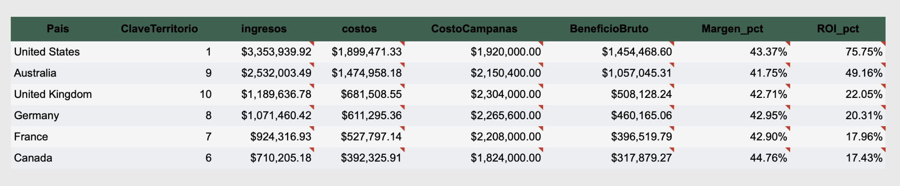

# Financial Performance Analysis with SQL
> This project demonstrates how SQL can be used to evaluate business performance and uncover actionable insights across markets, products, and customer segments.

## Project Overview
This project uses SQL to analyze financial and business performance across markets, products, and customer segments.

## Business Objective
The goal was to evaluate revenue, profit, margin, and ROI in order to identify high-performing areas and optimization opportunities.

## Tools & Technologies
- SQL
- Business Analytics
- KPI Analysis
- Data Aggregation
- Reporting

## Process
- Extracted and joined data from multiple relational tables
- Calculated key business metrics including revenue, profit, margin, and ROI
- Aggregated results by market, product, and segment
- Identified top-performing and underperforming areas
- Translated SQL outputs into business insights

## Key Insights
- Revenue alone does not always reflect profitability
- Margin and ROI provide a clearer view of business performance
- SQL-based analysis helps identify opportunities for market and product optimization

## Skills Demonstrated
- SQL Queries
- JOINs
- Aggregations
- KPI Calculation
- Business Intelligence
- Reporting & Insights
## SQL File
You can review the main SQL queries here:

[View SQL Queries](sql/financial_analysis_queries.sql)

## Business Questions
- Which markets generate the highest revenue?
- Which products have the strongest profit margins?
- Which campaigns deliver the best ROI?
- Which customer segments contribute the most to revenue?

## Business Analysis (C → F → I)

### Context
This analysis evaluates profitability by country using revenue, cost, and marketing investment data to identify the most efficient and high-performing markets.

### Findings
- The United States is the most profitable market, generating over $3.35M in revenue and achieving the highest ROI (75.75%)
- Australia shows strong performance with $2.53M in revenue and a high ROI (49%)
- The UK, Germany, and France have similar margins (~43%) but significantly lower ROI (17–22%), indicating less efficient marketing investment

### Implications
- Increase marketing investment in high-ROI markets such as the United States and Australia
- Reassess marketing strategies in lower-ROI markets (UK, Germany, France) to improve efficiency and return

## Sample Output

## Key Concepts

- **Profit Margin** measures business profitability after production costs  
- **ROI (Return on Investment)** evaluates the efficiency of marketing spend  

## Conclusion
SQL-based analysis provides a powerful way to evaluate financial performance beyond surface-level metrics. By focusing on profitability and ROI, businesses can make more informed strategic decisions.
